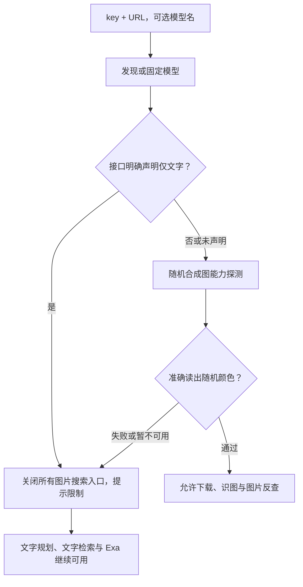

# 通用 AI 与 Exa 接入

## 最小配置

默认 `AI_MODE=api`，不预设服务商、模型或本机 AI CLI。Bot 从 `.env` 读取；独立 CLI 需要把同名变量导出到进程环境（不会自动读取 Bot 的 `.env`）。

```dotenv
AI_API_KEY=你的服务商密钥
AI_BASE_URL=https://你的接口域名/v1
# 可省略：自动读取模型列表；列表不可用时按提示填写
AI_MODEL=

# 可选网络检索，与 AI 配置相互独立
EXA_API_KEY=你的检索密钥
EXA_BASE_URL=https://api.exa.ai
```

只填写 key 和 URL 时，代码读取 `/models`：优先服务声明的默认模型，其次声明支持图片的模型，否则使用首个文本生成模型。模型列表在内存缓存 10 分钟。接口不提供模型列表或账号没有列表权限时，补填 `AI_MODEL`；也可用它固定所需模型，避免列表顺序变化。不会默认使用某家免费模型。

已有 `VISION_API_KEY / VISION_BASE_URL / VISION_MODEL` 继续有效；非空的新变量优先。备用服务可填写 `AI_FALLBACK_API_KEY / AI_FALLBACK_BASE_URL`，可选 `AI_FALLBACK_MODEL`。默认 API 模式失败时不自动启动本机 AI CLI；`AI_MODE=cli` 只供明确配置的旧文字模式使用。

## 支持的接口协议

| 接口 | AI_BASE_URL 示例 | 处理方式 |
|---|---|---|
| OpenAI Chat Completions 兼容 | `https://api.example.com/v1` 或完整 `/v1/chat/completions` | Bearer key，messages，解析 choices |
| Anthropic 原生 | `https://api.anthropic.com/v1`；代理需填完整 `/v1/messages` | x-api-key，anthropic-version，将图片转换为 base64 source |
| Gemini 原生 | `https://generativelanguage.googleapis.com/v1beta` 或完整 `/models/模型:generateContent` | x-goog-api-key，contents/inlineData，解析 candidates |
| Gemini 的 OpenAI 兼容端点 | 含 `/openai` 的根端点或完整 `/chat/completions` | 按 OpenAI 兼容协议处理 |

URL 必须使用 HTTPS，不能包含密钥、用户名、密码或查询参数；认证请求拒绝重定向。第三方代理按它实际提供的协议接入。专有 SDK、仅 Responses 的接口、私网 HTTP 接口不在当前协议范围；“换服务商”以符合上述协议为前提。明确拒绝 temperature、response_format 或要求 max_completion_tokens 的兼容接口可按错误信息最小化重试，不猜测模型名称。

Exa 是检索服务：支持 Exa 原生及兼容 `POST /search` 的端点，使用独立的 `EXA_API_KEY / EXA_BASE_URL`，不能把任意聊天 URL 填到 Exa 字段。根端点和完整 `/search` 均可；校验 HTTPS 与公网 DNS，拒绝认证重定向，检索结果只接纳真实 `booth.pm / *.booth.pm` 商品链接。检索不可用时保留其他搜索结果。

## 图片能力检测与入口限制

Bot 启动及首次图片查询先检查模型能力。CLI 的 `imgsearch` 在读文件或下载图片前执行相同检测。检测使用随机生成的 4 × 2 彩色方格 PNG，要求模型按顺序返回颜色；测试图仅在内存生成，不包含用户图片。不能仅凭模型名字或请求返回 200 开放图片功能。



- **明确不支持**：提示模型限制，只允许文字搜索；不下载用户图片、不调用视觉 AI、不启动 Bing/ascii2d 图片反查。
- **未知或检测失败**：同样关闭图片入口，提示暂未确认；网络错误、鉴权、额度不足不被误判成永久“纯文字”。
- **已验证多模态**：才允许识图提词与反向图搜。主服务不支持时，可使用已经接入且通过检测的备用多模态 API。
- **后续拒绝图片**：真实请求明确返回不支持图片时，立即撤销已缓存能力并关闭反查；不继续绕过限制。
- **独立 CLI、QQ 图片/回复图片、内部字节入口与旧 CLI 识图函数**均受限制。商品结果中的缩略图展示仍可使用，它不向文字 AI 发送图片。

能力结果按端点、key 的内存摘要和实际模型隔离；支持/不支持缓存 1 小时，未知缓存 60 秒。更换 key、URL 或模型会重新检测；重启也清空能力缓存。合成图检测会消耗少量模型配额，检测未通过不能证明模型永久不支持，只代表本次没有通过入场验证。所有 key、能力缓存与测试图均不落盘。Bot 通过环境传递已选接口给 CLI 子进程，key 不进入命令参数或 JSON 信封。

`RUN_PROFILE=benchmark` 默认禁止 AI，也关闭图片搜索；需独立账号/配额后显式开启 `BENCHMARK_ALLOW_AI=true`。检测通过只证明基本图片输入能力，不代表 OCR、搜品命中率或模型语义判断质量已通过评测。

实现：CLI 根目录 `provider_api.py`（Bot 对应 `src/plugins/booth_search/provider_api.py`）、CLI `cmd_imgsearch`、Bot `_verified_image_backend / extract_keywords`。配套最低版本为 booth-cli 1.5.0、Bot 0.3.0，查询缓存版本 10。
