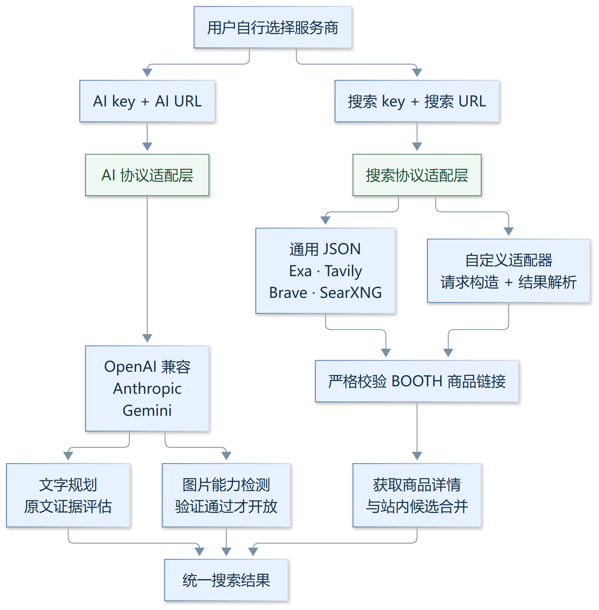
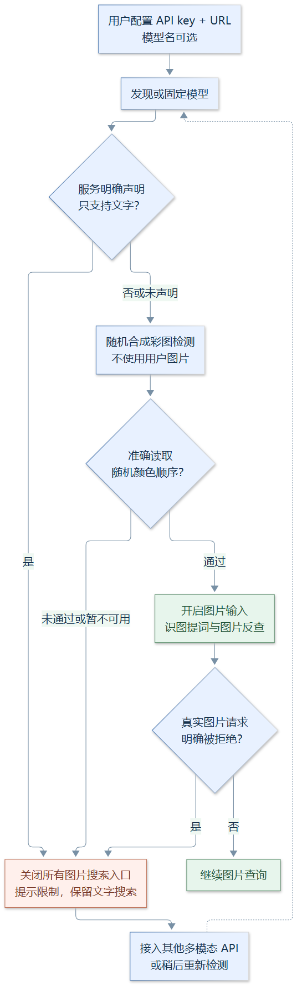

# 通用 AI 与网页搜索接入

## 最小配置

默认 `AI_MODE=api`，不预设服务商、模型或本机 AI CLI。AI 与网页搜索分别选择服务，彼此不共享 key。Bot 从 `.env` 读取；独立 CLI 需要把同名变量导出到进程环境（不会自动读取 Bot 的 `.env`）。

```dotenv
AI_API_KEY=你的服务商密钥
AI_BASE_URL=https://你的接口域名/v1
# 可省略：自动读取模型列表；列表不可用时按提示填写
AI_MODEL=

# 可选网页搜索，用户选择自己的服务，不预设厂商 URL
SEARCH_API_KEY=你的检索密钥
SEARCH_BASE_URL=https://你的搜索接口域名/search
SEARCH_PROVIDER=auto
# 设为 false 可关闭免费的 DDG 补充，仅调用用户选择的服务
SEARCH_DDG_ENABLED=true
```

只填写 key 和 URL 时，代码读取 `/models`：优先服务声明的默认模型，其次声明支持图片的模型，否则使用首个文本生成模型。模型列表在内存缓存 10 分钟。接口不提供模型列表或账号没有列表权限时，补填 `AI_MODEL`；也可用它固定所需模型，避免列表顺序变化。不会默认使用某家免费模型。

已有 `VISION_API_KEY / VISION_BASE_URL / VISION_MODEL` 继续有效；非空的新变量优先。同时填写新的 `AI_API_KEY + AI_BASE_URL` 时，省略或留空 `AI_MODEL` 就自动发现模型，不继承旧服务的 `VISION_MODEL`；需要固定模型时显式填写新的 `AI_MODEL`。备用服务可填写 `AI_FALLBACK_API_KEY / AI_FALLBACK_BASE_URL`，可选 `AI_FALLBACK_MODEL`。默认 API 模式失败时不自动启动本机 AI CLI；`AI_MODE=cli` 只供明确配置的旧文字模式使用。

## 支持的接口协议

更换主或备用连接时，新 key 或 URL 任一非空即选用整组新配置；遗漏另一字段不会继承旧服务的 key 或端点。需把新 key 与 URL 配齐，或清空两者恢复旧配置。

| 接口 | AI_BASE_URL 示例 | 处理方式 |
|---|---|---|
| OpenAI Chat Completions 兼容 | `https://api.example.com/v1` 或完整 `/v1/chat/completions` | Bearer key，messages，解析 choices |
| Anthropic 原生 | `https://api.anthropic.com/v1`；代理需填完整 `/v1/messages` | x-api-key，anthropic-version，将图片转换为 base64 source |
| Gemini 原生 | `https://generativelanguage.googleapis.com/v1beta` 或完整 `/models/模型:generateContent` | x-goog-api-key，contents/inlineData，解析 candidates |
| Gemini 的 OpenAI 兼容端点 | 含 `/openai` 的根端点或完整 `/chat/completions` | 按 OpenAI 兼容协议处理 |

URL 必须使用 HTTPS，不能包含密钥、用户名、密码或查询参数；认证请求拒绝重定向。第三方代理按它实际提供的协议接入。专有 SDK、仅 Responses 的接口、私网 HTTP 接口不在当前协议范围；“换服务商”以符合上述协议为前提。明确拒绝 temperature、response_format 或要求 max_completion_tokens 的兼容接口可按错误信息最小化重试，不猜测模型名称。

## 可替换的网页搜索接口



[放大查看 SVG](docs/images/provider-interfaces.svg)

`SEARCH_BASE_URL` 默认为空，搜索不依赖 Exa。已知官方域名可自动识别协议；其他域名默认使用通用 JSON。原生服务的代理需填写 `SEARCH_PROVIDER`。免费 DDG 补充可用 `SEARCH_DDG_ENABLED=false` 关闭，Bot 的 `WEBSEARCH_FALLBACK=false` 可关闭整个网页检索兜底。

| SEARCH_PROVIDER | URL 填法 | 请求与响应 |
|---|---|---|
| `auto` | 所选服务根端点或完整端点 | 精确官方域名识别 Exa/Tavily/Brave；其他按 json |
| `json` | 完整搜索 URL，原样使用 | POST query、max_results、include_domains；可选 Bearer key；results[].url |
| `exa` | 根端点或完整 /search | x-api-key；query、numResults、includeDomains；results[].url |
| `tavily` | 根端点或完整 /search | Bearer key；query、max_results、include_domains；results[].url |
| `brave` | 根端点、/res/v1 或完整 /res/v1/web/search | GET q、count；X-Subscription-Token；web.results[].url |
| `searxng` | 根端点或完整 /search | GET q、format=json；results[].url；可不填 key，实例需开启 JSON |

通用 JSON 契约可连接自建网关或其他兼容服务。请求示例 `{"query":"铃铛 site:booth.pm","max_results":8,"include_domains":["booth.pm"]}`，响应示例 `{"results":[{"url":"https://booth.pm/ja/items/123"}]}`。不同厂商的 HTTP 协议仍需适配，替换 URL 不会自动兼容任意专有协议。

其他协议通过可信 Python 启动代码中的 `search_api.register_adapter(name, build, extract)` 扩展：

- `build(query, key)` 返回 `(method, fields, headers)`；GET fields 编入查询参数，POST fields 编成 JSON。
- `extract(response)` 返回 URL 列表；公共层强制校验 BOOTH 商品链接，适配器不能跳过。
- 注册后设置 `SEARCH_PROVIDER=name`，填完整搜索端点。配置不会动态导入或执行任意代码；新增适配器后需重启，两仓库保持相同契约。

搜索端点校验 HTTPS 与公网 DNS，拒绝认证重定向，响应限制 2 MB。结果只接纳真实 `booth.pm / *.booth.pm` 商品链接。检索失败时保留其他结果。旧 `EXA_API_KEY / EXA_BASE_URL` 仅在没有新 `SEARCH_BASE_URL` 时启用；旧 key 单独配置仍使用原 Exa 服务，新端点永不继承旧 key。

原生协议参考：[Tavily](https://docs.tavily.com/documentation/api-reference/endpoint/search)、[Brave](https://api-dashboard.search.brave.com/documentation/services/web-search)、[SearXNG](https://docs.searxng.org/dev/search_api.html)。

## 图片能力检测与入口限制

Bot 启动及首次图片查询先检查模型能力。CLI 的 `imgsearch` 在读文件或下载图片前执行相同检测。检测使用随机生成的 4 × 2 彩色方格 PNG，要求模型按顺序返回颜色；测试图仅在内存生成，不包含用户图片。不能仅凭模型名字或请求返回 200 开放图片功能。



[放大查看 SVG](docs/images/image-capability.svg)

- **明确不支持**：提示模型限制，只允许文字搜索；不下载用户图片、不调用视觉 AI、不启动 Bing/ascii2d 图片反查。
- **未知或检测失败**：同样关闭图片入口，提示暂未确认；网络错误、鉴权、额度不足不被误判成永久“纯文字”。
- **已验证多模态**：才允许识图提词与反向图搜。主服务不支持时，可使用已经接入且通过检测的备用多模态 API。
- **后续拒绝图片**：真实请求明确返回不支持图片时，立即撤销已缓存能力并关闭反查；不继续绕过限制。
- **独立 CLI、QQ 图片/回复图片、内部字节入口与旧 CLI 识图函数**均受限制。商品结果中的缩略图展示仍可使用，它不向文字 AI 发送图片。

能力结果按端点、key 的内存摘要和实际模型隔离；支持/不支持缓存 1 小时，未知缓存 60 秒。更换 key、URL 或模型会重新检测；重启也清空能力缓存。合成图检测会消耗少量模型配额，检测未通过不能证明模型永久不支持，只代表本次没有通过入场验证。所有 key、能力缓存与测试图均不落盘。Bot 通过环境传递已选接口给 CLI 子进程，key 不进入命令参数或 JSON 信封。

`RUN_PROFILE=benchmark` 默认禁止 AI，也关闭图片搜索；需独立账号/配额后显式开启 `BENCHMARK_ALLOW_AI=true`。检测通过只证明基本图片输入能力，不代表 OCR、搜品命中率或模型语义判断质量已通过评测。

实现：两个项目共享 `provider_api.py / search_api.py` 契约，Bot 对应文件位于 `src/plugins/booth_search/`；图片入口由 CLI `cmd_imgsearch`、Bot `_verified_image_backend / extract_keywords` 控制。当前配套版本为 booth-cli 1.5.1 / Bot 0.3.1，Bot 最低需要 CLI 1.5.0，缓存版本 11。PNG/SVG 随仓库提交，图源保存在 [docs/diagrams](docs/diagrams/)。
