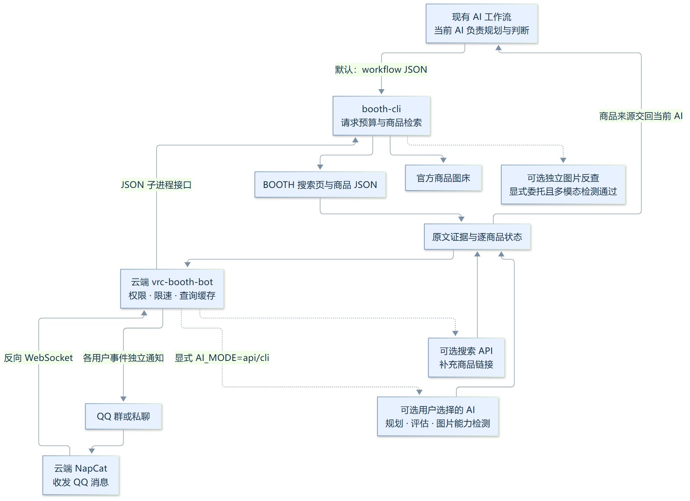
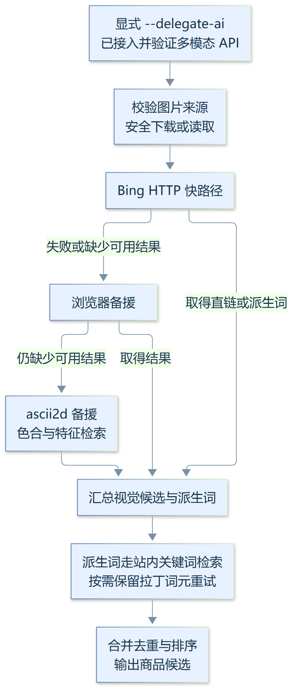

# 架构与实现思路 —— booth-cli（引擎层）+ vrc-booth-bot（实现侧）

本文面向想读懂或二次开发的贡献者，讲清三件事：**系统怎么运作**、**每一层的实现与兜底思路**、**参考/借鉴了哪些开源项目**。部署步骤见 [PROXY_DEPLOYMENT.md](PROXY_DEPLOYMENT.md)，用法见各仓 README。

## 2026-10-03 默认单 AI 工作流

当前 booth-cli 1.6.0 / Bot 0.4.0 / CACHE_VERSION 14，Bot 需 CLI 1.6.0+。默认由调用工具的当前 AI 做规划与判断；workflow 返回来源，内部模型调用数为零。API key 存在不自动启用另一模型。机器接入用 schema + stdin JSON 或 workflow_client.search，详见 [WORKFLOW_INTEGRATION.md](WORKFLOW_INTEGRATION.md)。


[放大查看 SVG](docs/images/caller-workflow.svg)

workflow 的完整检索轴不再拆词/改写，最多六轴、六件全文详情；返回商品说明、规格、精确原图/缩图地址、来源摘要和缺失状态，相关性/兼容性为 unknown，由当前 AI 核查。工具不自动调用网页检索或第二轮模型，当前 AI 可调整词继续。共享 BOOTH 预算、缓存与限速仍生效。

可选 smart --delegate-ai 才使用配置的 API 规划/评估，默认 smart 仅本地行业词/读音扩展。Bot 默认 AI_MODE=caller，独立 QQ 仅文字检索；显式 api/cli 保留独立 AI 服务功能。caller 不探测视觉模型，当前 AI 若无宿主多模态能力就提示限制并仅文字搜索；已支持时它自己读图提词、核查候选。独立 imgsearch 须显式 --delegate-ai 并先通过配置的多模态 API 检测。

下文的模型规划、评估、重试和反查管线描述**显式委托模式**；历史验收记录保留原版本和边界，不能当作默认 caller 链路的新评测。

## 2026-10-02 通用接入与图片能力约定（历史版本）

- 当前配套版本 booth-cli 1.5.1 / Bot 0.3.1 / CACHE_VERSION 11，Bot 需要 CLI 1.5.0+。默认 API 不绑定供应商；AI_API_KEY + AI_BASE_URL 自动发现模型，没有模型列表时提示补填 AI_MODEL；新连接不继承旧模型名，旧 VISION_* 兼容。
- provider_api.py 在两个仓库保持一致，适配 OpenAI Chat Completions 兼容、Anthropic Messages、Gemini generateContent；原生接口转换认证头、文本/图片请求结构与响应。不向其他服务商发送专用会话头，API 模式不自动回落本机 AI CLI。
- 使用模型能力声明和随机合成图片探测，不能凭模型名称或 HTTP 200 判断。未配置、纯文字或能力未知时，关闭全部图片搜索入口，只允许文字搜索并提示限制；用户图片不参与能力探测。接入已验证多模态后才开放下载、识图与反向图搜。真实图片明确被拒绝时撤销缓存能力。
- search_api.py 在两仓保持一致；SEARCH_API_KEY / SEARCH_BASE_URL 独立配置服务，SEARCH_PROVIDER 选择通用 JSON、Exa、Tavily、Brave、SearXNG 或注册的适配器。未知域名默认 JSON，不绑定 Exa；旧 EXA_* 仅在没有新连接时有效，新端点不继承旧 key。
- 所有检索适配器均校验 HTTPS/公网 DNS，不跟随认证重定向，响应最多 2 MB，结果只接纳真实 BOOTH 商品链接。DDG 补充可关闭；失败保留其他候选。
- 模型/能力只在内存缓存，按端点、key 摘要、实际模型隔离；不持久化凭据、目录或测试图。完整配置、限制和图片流程图见 [AI_SETUP.md](AI_SETUP.md)，PNG/SVG 与可维护图源随仓库提交。以下 2026-10-01 记录保留对应历史版本。

## 2026-10-01 审查修复约定

- 引擎版本为 **booth-cli 1.4.0**，bot 版本为 **0.2.0**，查询缓存语义版本为 **9**。两个仓库独立发布，bot CI 使用固定的母项目提交验证 JSON 信封与搜索参数。
- 保留「规划 → 搜索 → 评估 → 第二轮」以及行业同义词、读音变体和保守重试。bot 的 API、仅兜底 API、CLI 三种配置均可执行规划与评估。确认结果要求至少三个不同且属于本轮候选的引用；证据不足保持未确认。
- 标题命中与说明中的关键词提及只用于相关度排序，不等同于确认素体兼容性。详情失败、只有标题提及、明确否定分别保留不同状态；展示文案说明证据范围。
- 图搜与网络兜底也执行成人内容和标签筛选；未知详情不作为满足条件的证据。bot 每次调用 search 显式传 no_vrc，再按 VRC_TAG 添加标签，置空确实关闭筛选。
- bot 异步处理链中的 CLI 子进程调用在工作线程运行。站内请求全部失败与合法零结果分别提示；部分失败保留已取得的结果并注明。
- 图片仅接受配置中的 HTTPS 精确域名；逐跳检查域名和公网 DNS，连接固定到检查过的 IP，并使用原域名验证 TLS。大小上限 10 MiB，检查图片签名。消息 URL 不允许读取本地文件；盲测脚本通过内部字节入口注入样本。
- 带认证的 AI 与 Exa 请求拒绝 HTTP 重定向。母项目的限速覆盖每次重定向和重试，SQLite 缓存支持受锁保护的多线程读写，bot 信封内的 no_cache 在本次请求生效。
- 多页搜索按起始页连续抓取并使用同一种可翻页排序。合并转发使用实际 has_next、页码、查询词及 search/r18 模式生成提示。bot 缓存键还包含影响结果的配置摘要。
- 离线检查：两仓运行 `python -m unittest discover -s tests -v`；bot 的真实母项目契约检查运行 `BOOTH_CLI_TEST_PATH=/path/to/booth.py python -m unittest discover -s integration -p '*contract.py' -v`。GitHub Actions 在 Python 3.10/3.12 上执行；测试不需要 API 凭据、QQ 连接或 booth 的 PATH 安装。

## 2026-10-01 瓶颈修复约定

- request_budget.py 使用同机共享 SQLite 短事务分配出站许可，默认间隔 1 秒。事务外执行睡眠、HTTP 和缓存操作；重试与重定向都占用许可，缓存命中不占用。默认文件为 ~/.booth-cli/request_budget.sqlite3，可用 BOOTH_REQUEST_BUDGET_DB 指定同机公共位置；各子进程必须指向同一文件。数据库不可用时拒绝出站；跨主机共享和网络文件系统不在此实现范围。
- 429/503 发布全局冷却。合法 Retry-After: 90 保留 90 秒；本次最多等待 60 秒或查询剩余时间，超出时结束当前请求并保留冷却。非法负数、NaN、无穷值回退本地退避。1 秒是当前保守策略，没有把它当成 BOOTH 官方公布的容忍阈值。
- bot 文本查询默认总时限 180 秒、首轮最多 12 次 CLI 出站许可，二轮显式扩展为总计 18 次；重试、重定向和详情均计数。母项目 smart 同样携带请求上限与出站截止时间。首轮详情最多 6 件，二轮补最多 3 件新商品，展示复用详情。容量包含网络失败，预算耗尽可保留已取得结果。
- 站内搜索覆盖商品名、说明、标签等字段；标题命中只用于排序，不再硬删除标题不含词的候选。bot 接收同页最多 60 个候选，不增加页数。评估输入包含完整商品名、品类、标签、围绕核实词的说明摘录、商品 ID 与来源摘要；完整说明保留到评估结束，用于识别末尾否定。
- 每条命中必须给出属于该商品字段的连续原文引用；适配/功能核实词非空时，要求可用商品说明。来源不足、明确否定或相互矛盾时不放行；仍有模型相关性判断，逐字引用不构成兼容性保证。展示逐商品区分相关候选、未核实和不满足要求，三条证据不推广到整批结果。
- 复合需求中的正向行业词也经过原有种子表；否定片段不注入对应种子。二轮评估词和反馈规划词统一经过行业词与读音规范化，跳过已搜词，最多 3 个新词。原有 20 项词表、优先顺序和保守重试规则保留。
- bot 方案缓存不含页码；翻页复用首轮方案，反馈规划不缓存。相同在途结果/方案共享一个有截止时间的生产任务；取消一个等待者不会取消其他等待者，过程通知发送到各自事件。只有生产任务占全局并发槽。
- 缓存键加入固定代码/提示词文件及 CLI 源码指纹，启动时计算并缓存；不读取 .env、认证文件或日志。部署需重启进程。保留 CACHE_VERSION 作为人工保险；计划与结果各自记录过期时间，短计划 TTL 不删除长结果 TTL。
- RUN_PROFILE=benchmark 使用独立缓存语义，默认禁止活动链路的 AI 调用；仅独立账号/配额验证后显式设置 BENCHMARK_ALLOW_AI=true。同账号多 key 不视为配额隔离。生产服务器仅用于部署和验收，大规模盲测在独立环境运行。
- 本轮没有启用第三方索引、向量库或第二模型二判。它们需独立配额的固定样本盲测比较相关率、延迟、请求量和未知比例，才能决定是否发布；本轮测试不能证明查询命中率达到 98%。
- 搜索路径已有关键词时不再重复 q 参数；默认人气排序省略 sort，而 new/liked 显式传值。真实页面验证确认可避免一次规范化重定向，并让新着翻页实际生效。
- 活动 plan/evaluate 使用已知 GLM 文本模型的结构化参数。GLM 5.3 必须开启 thinking，使用 low 推理深度与 JSON 输出，评估总输出上限 4096；旧版已知文本模型可关闭 thinking。其他模型不添加这些参数。推理文本仍不作为结果证据，归档翻译/识图参数不随之改动。参数依据：[官方对话接口](https://docs.z.ai/api-reference/llm/chat-completion)。

## 1. 系统总览与运作原理



[放大查看 SVG](docs/images/system-architecture.svg)

**一次文本查询的生命周期**（`__init__.py::_handle_text`）：

1. 指令解析：正则匹配 `/vrc search`，末尾独立数字（1-3 位）剥为页码。
2. 访问控制：群白名单（白名单外静默忽略）、每用户限速（10 秒间隔、每分钟 5 次）。
3. 查询缓存：相同查询（模式/页码/词）TTL 内直接回缓存结果，标注「可能非最新」。
4. 方案规划：默认 caller 只做本地词扩展；显式 AI_MODE=api/cli 才由模型规划并复用翻页方案缓存。
5. 搜索执行：多个检索词 3 路并发调 CLI → 合并去重 → 标题相关度排序；出站由共享预算串行准入。
6. 详情与评估：最多补 6 件完整说明 → 按来源评估 → 必要时最多 3 个新词重搜、补 3 件新详情并再评估。
7. 结果返回：按商品展示证据状态；QQ 合并转发附商品缩略图及实际翻页提示，明确拒绝时回退纯文本。

**一次识图查询的生命周期**（`_handle_image`）：模型能力探测（随机合成图）→ 不支持或未知则提示并终止图片流程；已验证多模态才下载 QQ 图片 → 视觉 AI 提词（图内文字逐字转写）→ CLI 反向图搜（Bing 引擎链，见 §4.3）→ 图搜派生词并入关键词 → 空关键词时知名商品回忆兜底 → 前 3 个关键词各搜一轮合并 → 统一重排 → 补详情 → 合并转发。

### 数据来源（非官方接口）

Booth 无官方公开 API，全部数据来自页面内嵌结构：

| 用途 | 端点 | 提取方式 |
|---|---|---|
| 搜索 | `/ja/search/{query}`、`/ja/browse/{分类}` | 正则解析 `<li class="item-card">` 的 `data-product-id/brand/price/category/event` 属性 |
| 单品 | `/ja/items/{id}.json` | 官方页面自用的 JSON 接口，直接 `json.loads` |
| 商店 | `{sub}.booth.pm/items` | 解析 `data-item="..."` 内嵌 JSON（多数店铺整页前端加载，服务端只渲染最新几件） |

关键站点特性与对策：

- **年龄门**：请求带 cookie `adult=t` 绕过；R-18 结果仍由 `adult` 参数控制。
- **R-18 是一元标记**（情色与怪诞/R18G 同旗、无独立过滤）：默认 `adult=include` 联合搜索，
  每条结果带 `is_adult` 标记，由展示侧决定过滤策略；bot 的 `/vrc r18` 专项搜索仅管理员可用。
- **popularity 排序忽略 page 参数**（站点行为）：bot 翻页时自动切按新着排序并在结果里标注，
  否则翻页永远返回第一页。

## 2. booth-cli（引擎层）实现原理

默认引擎为 booth.py/agent_workflow.py/workflow_client.py/request_budget.py/search_evidence.py，只用标准库；可选 smart 的读音变体使用 pykakasi，委托服务适配在 provider_api.py/search_api.py。

- **解析而非抓取渲染**：Booth 搜索页是服务端渲染的，商品卡片的 data 属性就是结构化数据，
  正则提取即可，无需浏览器；单品走 `.json` 接口，比解析 HTML 更稳。
- **统一出站层 `http_get`**：所有请求过同一管道——URL 白名单校验（仅 `https://*.booth.pm`，
  重定向逐跳复验）→ sqlite 磁盘缓存（商品 6h / 搜索页 10min，`--no-cache` 跳过）→
  同机跨进程限速（共享 SQLite，距上一请求许可 ≥1 秒）→ Retry-After 感知的共享冷却与重试
  （最多 4 次，指数退避+抖动）→ gzip 解压。
- **bot JSON 信封**（`booth bot`）：子进程进出、stdout 单行 JSON、退出码恒 0、永不抛栈。
  信封里的 snake_case 参数转成 argv 走同一条 argparse 路径——bot 与 CLI 人类用法永远行为一致。
- **可选智能搜索 `booth smart --delegate-ai`（与 bot 显式 AI 模式同源）**：需求式描述走完整
  bot 侧管线——AI 关键词（单词级 + desc_keywords）→ 单词级分词 3 线程并发合并
  （出站受同机共享限速约束）→ 有上限的完整详情 → 来源证据评估/二轮搜索 →
  空结果网络检索兜底与相关度展示。AI 环境变量与 bot 同名（一份 .env 两边通用），缺省降级为
  分词+读音变体直搜。实现于 `smart_search.py`（AI/检索走 urllib；pykakasi 为必装
  依赖，提供假名读音变体）。search/smart 默认收窄 VRChat 圈
  （`--no-vrc` 关闭）；popularity 排序翻页自动切新着并标注 sort_note。
- **版本守卫**：bot 首次调用前校验 booth --version ≥ 1.6.0，保证 caller 和显式委托契约；进程内只查一次。
- **错误即信息**：Cloudflare 盾（"Just a moment"）检测后报「该店无法直接抓取」，
  年龄确认页误返回时报内部错误，搜索页语言不渲染时报「试试 --lang ja」——
  每个失败都告诉调用方下一步能做什么。

## 3. bot 的可选 AI 模式：三链路设计

### 3.1 日文/拉丁词与归档分流

活动入口对日文/拉丁词也执行方案规划；模型可以保留原词。旧 _looks_chinese 和强制翻译函数保留归档，未参与当前分流。AI 不可用时按原词检索。

### 3.2 文本链路（方案 + 分词搜索 + 来源评估）

> 本节策略已下沉为 CLI 的 `booth smart`（`smart_search.py` 为 bot 侧 vision/webfind/rank
> 的零依赖移植，环境变量同名共用）——两仓一套策略，两个入口。
> 旧「强制翻译」链路（`vision.translate_keywords` / `smart_search.translate_keywords` /
> `_looks_chinese` 等）保留归档、未启用——是否翻译已改由方案阶段模型自决。

1. **搜索方案**（`vision.plan_search` / `smart_search.plan_search`）：LLM 理解需求输出
   单词级日语关键词 + desc_keywords + translated 标记——**翻译只是可选项**，输入已是
   日文/专名时直接沿用原词（不强行翻译）；E 站（E-Hentai）AI 翻译本子类开源实践的
   术语约束与写法规范（单词级/完整片假名/行业词）在此阶段生效。
2. **变体扩展** `expand_reading_variants`：pykakasi 汉字→平假名读音（信濃→しなの，
   Booth 不做跨字形归一）；含空格的词追加去空格连写形（ショコラ ドレス→ショコラドレス）；
   同读音关键词（リング/指輪）只保留首个，省检索槽位。pykakasi 为必装依赖。
3. **分词搜索** `_search_merged`：关键词拆到单词级（≥2 字），连写形整词保留，
   最多 6 词 3 路并发搜索，结果合并去重，标题含词候选优先；保留标题未命中的候选供说明评估。
4. **结果评估 + 二轮重搜**（evaluate_results）：先拉有上限的完整详情，LLM 评估来源字段，
   verdict=ok 必须给出 ≥3 条具体命中及通过原文校验的 evidence，否则判 retry；明显偏离 →
   retry 并给第二轮关键词；QQ 侧经 notify 提示「正在执行第二轮搜索」后重搜，
   两轮合并并再评估一次，带有效来源的相关候选置顶，其余标注「未核实」。
   **保守 retry**：评估放行但标题命中率 ≤1/3 时仍触发二轮（词源=评估词，
   或带第一轮教训 `feedback` 重新规划）——防评估员过宽。
   知名商品回忆不再是文本链路的独立步骤——二轮关键词由评估员给出，天然覆盖
   该场景（识图链路仍用 recall 兜底）。
5. **行业同义词种子层**（`INDUSTRY_SYNONYMS` + 方案提示词对照示例）：中文泛称 →
   Booth 行业词的硬映射（墨镜→サングラス、枪械→銃/ガン、法线贴图→ノーマルマップ…，
   盲测失败词沉淀），方案阶段命中即插入；主要靠提示词让模型举一反三。
6. **分词与排序**：单词级检索词（**CJK 单字是合法词**——鈴/耳 曾被 ≥2 字过滤丢掉，
   导致相关搜索整个缺席）；命中更多检索词的候选优先，同分按首个命中词序位
   （首选词鈴 的命中排在尾部词ベル 的子串噪音前）；标题只是一个排序信号。
7. **描述核实** `desc_keywords`：翻译提示词同时产出『需要到商品说明文核实的词』
   （対応素体/仕様 段落里的素体名/功能名）——「适用于XX素体的服装」这类兼容性需求，
   对应信息常写在商品说明里。候选全文在本地保留，送评估的片段最多 900 字；
   rank.desc_boost 按提及/标题/否定重排，最终仍区分相关证据、未核实与不满足要求。

### 3.3 识图链路（视觉 AI + 反向图搜双路合并）

- 所有图片入口先验证多模态能力；未配置、不支持、检测未知均停止图片处理，只允许文字搜索，不保留纯图片反查兜底。备用多模态 API 也必须通过检测；旧 AI CLI 图片函数保持关闭。
- **视觉 AI 提词**的提示词要求图内文字**逐字转写**（日文保持日文、严禁罗马字/意译）——
  图内文字往往就是商品名，是最高价值信号；图内无文字时按外观特征（发色/服装/配色）给词。
  推理模型偶发空转（返回空关键词）自动重试一次。
- **CLI 反向图搜**（下一节详述）返回候选 ID 与派生词；派生词（Bing 对图内文字的 OCR）
  并入关键词搜索队列最前。
- **合并重排**：图搜候选 + 各关键词搜索命中进同一池去重，标题含任一关键词（视觉词/派生词/
  回忆词）的置顶；`via` 字段标注来源（图搜/关键词/网络检索）。
- **知名商品回忆** `recall_products`：模型空转或图内无文字时，拿提示词/派生词当描述，
  让模型回忆最可能的具体商品名（日文原名，含作者名更好）——用模型知识补偿感知失败。

## 4. 兜底思路：每一层都有退路

设计原则：**单点失败不致命，降级要告知**。每级兜底触发时都在结果里注明退化方式
（如「AI 翻译不可用：xxx（已用原词直搜）」），用户永远知道拿到的是降级结果还是正常结果。

### 4.1 网络与解析层（booth-cli）

| 故障 | 兜底 |
|---|---|
| 429/403/5xx 限流或临时错误 | 优先读响应 `Retry-After`，无则指数退避+抖动，最多 4 次 |
| Cloudflare 盾（店铺级） | 识别 "Just a moment" 页，明确报「该店无法直接抓取，可改用 item <ID> 逐个查」 |
| 单品 JSON 被拒（403 等） | 先抓 HTML 页取 `csrf-token`，带 `X-Csrf-Token` 头重试 |
| HTTP 内容缓存打不开 | 降级为无缓存；共享请求预算库不可用则拒绝出站 |
| 图片下载 | 校验 JPEG 魔数（`\xff\xd8`），pximg 必须带 `Referer: https://booth.pm/` |
| 搜索页语言不渲染 | 报错提示「试试 --lang ja」（ja 偶发不渲染，靠重试兜住，见 §8） |

### 4.2 搜索策略层（bot）

| 场景 | 兜底链 |
|---|---|
| 文本查询 | plan → 分词搜索 → 详情证据评估 → 可选二轮；全空时 DDG/Exa 网络检索商品 ID 并按详情筛选 |
| 「适用于XX素体」类兼容需求 | AI 翻译输出 desc_keywords（对应素体/功能名）→ 候选拉详情核对商品说明文 → 说明文命中置顶并注明核实结果（未命中也如实告知） |
| 日文/拉丁词 | plan 可沿用原词；方案词全空时原词检索，再按需网络兜底 |
| AI 翻译失败 | 退回原词直搜，结果注明「AI 翻译不可用：原因（已用原词直搜）」 |
| 翻译输出坏 JSON | 强化指令（只输出 JSON 本体）重试一次，仍失败视为该后端失败 |
| Booth AND 短语脆弱 | AI 关键词强制单词级 + 连写形变体 + 读音变体多路并发 |

### 4.3 图搜引擎链（booth-cli imgsearch）

以下引擎链仅在显式 --delegate-ai 且多模态检测通过后开放；检测在读文件、下载或上传前完成。当前 AI 的原生识图检索使用 workflow，不需要该链路。



[放大查看 SVG](docs/images/reverse-search.svg)

关键实测结论（协议逆向自 PicImageSearch，海外出口验证）：

- Bing knowledge API 路线**不可行**：无 `X-Image-Knowledge-Signature` 时恒返回空壳，
  而该签名只存在于 JS 渲染页面，纯 HTTP 拿不到——所以快路径改为「重定向链取派生词」方案。
- 会话 Cookie 必须跨请求保持：上传 302 下发的 Cookie 是后续 detailV2 跳转的通行证。
- Bing 即使给不出视觉直链，**派生词也足以驱动关键词搜索**——这就是最后一层兜底的依据。

### 4.4 AI 后端链（bot）

```
显式 AI_MODE=api 后：主 API（AI_API_KEY + AI_BASE_URL，可自动发现模型）
  ↓ 失败/额度耗尽
可选备用 API（AI_FALLBACK_API_KEY + AI_FALLBACK_BASE_URL）
  ↓ 失败
文字原词直搜，保留未核实状态与失败提示

图片：必须有至少一个已验证多模态 API，否则关闭全部图片入口
AI_MODE=cli：仅显式启用的旧文字模式，不作为默认 API 失败后的隐式兜底
```

- `friendly_ai_error` 把异常翻译成可行动的中文：402 额度不足、429 限流/配额、
  401 认证失败、403 权限/安全策略、5xx 上游故障、超时；不猜测服务商的恢复时间——
  群友看到错误就知道该等还是该换词。
- API 请求 UA 用浏览器标识：Cloudflare WAF 会拦「数据中心 IP + python 默认 UA」的大 body POST。
- 推理模型可能把内容放在 `reasoning_content`、把思考过程混进关键词——
  `_is_reasoning_prose` 按前缀/长度/结尾特征过滤泄漏文本。
- CLI 文字后端的输出需清理 ANSI 色码；图片必须使用可验证的 API。

### 4.5 输出与运维层（bot）

| 故障 | 兜底 |
|---|---|
| 合并转发发送失败 | 回退纯文本 |
| 单节点商品图下载失败 | 该节点降级为纯文本，其余节点不受影响 |
| pximg 原图过大导致 base64 发送失败/极慢 | 原图 URL 改写为 300x300 缩略图（`/c/300x300_a2_g5/` + `_base_resized.jpg`） |
| CLI 旧版本 | 首次调用时版本守卫拦截，报「请更新 booth-cli 或指定 BOOTH_CLI_PATH」 |
| 用户刷指令 | 明确返回「请 N 秒后再试」与限流规则，而非静默丢弃 |
| 缓存命中 | 标注「（缓存结果，可能非最新）」 |

## 5. 性能与额度设计

- **缓存**：CLI HTTP 内容缓存挡重复抓取；bot 方案缓存与结果缓存默认各 30 分钟、共享 300 条容量，各自保存过期时间。页码只进入结果键。图片结果不持久缓存，当前在途相同请求仍可共享。
- **限速与容量**：同机所有 CLI 请求共用 SQLite 准入间隔和 429/503 冷却；bot 保留用户限速及默认 2 个生产任务的全局槽。同查询等待者不重复占槽。
- **成本与诊断**：首轮 6 搜索词 + 最多 6 件详情，二轮再加最多 3 词 + 3 件详情，总许可默认 12/18；HTTP 重试也计数。结果 metrics 提供 wire_requests 与阶段耗时，缓存命中可避免出站。
- **取消与时限**：等待者使用 shield，单个取消不影响其他人；共享生产任务受查询总时限控制。工作线程中的 CLI 子进程使用剩余时间作为超时，并在 CLI 内检查出站截止时间。

### 5.1 防风控规则总览（对外部服务的全部防御面）

| 面 | 机制 | 位置 |
|---|---|---|
| 请求间隔 | 跨进程共享的 SQLite 准入（`BEGIN IMMEDIATE` 原子核发许可，默认 ≥1 秒；重定向/重试/详情请求同计入），子进程经 `BOOTH_REQUEST_BUDGET_DB` 共用同一库 | `request_budget.py` |
| 429/503 冷却 | 服务端 `Retry-After` 写入共享冷却表，同机全部 CLI 进程生效；超出可等待范围直接报错而非硬闯 | `request_budget.cooldown` |
| 每查询出站上限 | 首轮默认 12 次、二轮 18 次（可配 6-100），配合查询总时限（默认 180 秒）双保险 | bot `execution.query_scope` + `request_budget.query_context` |
| 缓存减负 | HTTP 内容缓存命中不消耗出站许可；bot 双层缓存（CLI 内容 + bot 查询结果）挡重复抓取 | `booth.py` + `qcache.py` |
| 退避礼貌 | 重试遵循 `Retry-After`，无头时指数退避+抖动；UA 用浏览器标识（Cloudflare WAF 拦 python 默认 UA 的大 body POST） | `booth.py`/`smart_search.py` |
| 图搜侧 | Bing 会话 Cookie 跨请求保持；风控弹回页（FORM=SBIRDI/SBIHMP）识别即回落 playwright（持久 profile + 反自动化标志），不做硬闯 | `reverse_search.py` |
| bot 用户面 | 每用户 10s 间隔 + 每分钟 5 次；跨用户全局并发槽（默认 2）；同查询等待者不重复占槽 | bot `access.py`/`execution.py` |
| AI/搜索 API | AI/搜索适配器出站与 booth 预算相互独立；AI 传输错误/5xx 有限退避重试（≤2 次），429 直接上报不硬闯 | `provider_api.py`/`vision.py` |
| 评测隔离 | `RUN_PROFILE=benchmark` 默认禁止 AI 调用（除非显式 `BENCHMARK_ALLOW_AI=true`）；大规模评测应使用独立账号/配额 | `smart_search.py` |

> 边界：限速按「一台机器」计——多机部署各自独立预算；`BOOTH_REQUEST_BUDGET_DB` 未设置时
> 用默认路径（同机子进程自然共享）。bot 对 CLI 的预算上限（12/18）是硬约束，超限时明确
> 报错而非静默放宽。

### 5.2 关注清单与变动提醒（watch，2026-10 新增）

借鉴 [MioVRC_AssetManager](https://github.com/CokoIya/MioVRC_AssetManager) 的
已购标记与 Booth 更新检查，落在搜索工具的定位内：

- **CLI `booth watch add/remove/list/check`**：本机 sqlite 快照
  （`BOOTH_WISH_DB` 可覆盖）；`check` 逐项 no_cache 拉详情对比，产出
  降价/补货/商品更新/改名变动；单轮上限 30 项，出站计入共享请求预算。
- **搜索标记**：search/smart 的 items 命中关注清单时带 `watched: true`。
- **bot `/vrc watch`**：add/list/check/remove 指令（信封 watch action）；
  `WATCH_ENABLED` 开启后 asyncio 后台循环定时 check（间隔 ≥600s），
  有变动时推送 `WATCH_NOTIFY_GROUPS`（空则群白名单）。

## 6. 参考的开源项目

### 直接借鉴（协议与机制）

| 项目 | 借鉴点 |
|---|---|
| [kitUIN/PicImageSearch](https://github.com/kitUIN/PicImageSearch) | Bing 视觉搜索纯 HTTP 协议（multipart 上传 → bcid → detailV2 链）与 imageSignature 解密（XOR + 偏移 3） |
| [requests-cache](https://github.com/requests-cache/requests-cache) | 持久 HTTP 缓存设计：URL 为 key、sqlite 存储、按资源类型分 TTL |
| [tenacity](https://github.com/jd/tenacity) | 重试策略：优先响应 `Retry-After`，否则指数退避 + 抖动 |
| E 站（E-Hentai）AI 翻译本子类开源实践 | 设计参考（非代码）：小语种翻译的术语约束与写法规范——中文翻译提示词的结构来源 |

### 运行组件

| 组件 | 用途 |
|---|---|
| [NoneBot2](https://nonebot.dev/) + OneBot v11 适配器 | bot 框架：事件/规则/API 调用 |
| [NapCat](https://github.com/NapNeko/NapCatQQ) | QQ 协议端，反向 WebSocket 接入 |
| [playwright](https://playwright.dev/python/) | 图搜浏览器备援（持久 profile 过 Cloudflare） |
| [pykakasi](https://codeberg.org/miurahr/pykakasi) | 汉字→假名读音变体（可选依赖，未装自动跳过） |
| httpx | bot 侧异步 HTTP |

### 调研后未采用（及原因）

- **boothmate / BoothPM-SDK / gallery-dl / Booth2RSS / booth-manager**：都是给人写代码用的库
  或 RSS/下载工具，没有「给 AI agent 用的搜索 CLI/MCP」——这是自己写 booth-cli 的原因；
  但它们验证过的页面结构（`li.item-card` data 属性、`/ja/items/{id}.json`）被直接沿用。
- **Google Lens**：对自动化客户端 403 封锁结果页，绕不过。
- **SauceNAO**：匿名账户禁用 JSON API，且索引不含 booth.pm。
- **ascii2d**：保留为备援而非主路——索引偏 pixiv 同人图，booth 商品页覆盖不如 Bing。

## 7. 盲测方法论：设计决策的依据

三链路的策略不是拍脑袋，全部由盲测数据驱动：每条链路盲抽 100 个 VRC 对口样板，
目标准确率 ≥90%，按「跑测 → 改策略 → 复测」自迭代
（booth-cli `scripts/`：`samples_vrc100.py` 取样、`zhgen100.py` 生成用户口吻中文查询、
`blind_one.py` 单链路 harness，支持 `--start/--end/--dir` 切片并行；数据集在服务器 `~/vblind100/`）。

最终成绩：**JP 95% / ZH 100% / IMG 93%**。

IMG 链路是这套方法论的代表案例：一测 Top1 约 50% 就撞上瓶颈——图片里的**艺术字**
（风格化标题、店铺水印）会干扰视觉模型的 OCR；接入 **Exa 网络检索**与 **LLM 自有
知识库的知名商品回忆**（自我纠错层）后，二测突破瓶颈到 93%。

盲测推翻/确立过的决策举例：

- 中文查询含 4 字以上拉丁词时不走 AI 翻译（原词直搜 Top1 5/7 vs 翻译 0）。
- 分词搜索必须拆到单词级（Booth 短语 AND 匹配脆弱）。
- 图搜派生词必须做关键词合并（把无字图命中率从 0 拉起来）。
- Bing HTTP 快路径 knowledge API 路线不可行（双环境实测空壳）。

## 8. 已知限制与下一步

1. **IMG 极端艺术字仍会误读**：93% 之后的剩余头部集中在视觉模型对风格化字体的
   识别，换更强视觉模型或专用 OCR 可再进一步。
2. **查询延迟 1-2 分钟**：中文/识图链路的 AI 串行调用固有成本，可考虑预取或更快端点。
3. **Booth ja 搜索页偶发不渲染**：未修，靠重试兜住。
4. 个别店铺开了 Cloudflare 盾无法抓取（会精准报错）；多数商店商品列表前端加载，
   `shop` 只能取到服务端渲染的最新几件。
5. 未登录功能（收藏/购物车/已购下载）不在工具范围。

## 9. 安全边界汇总

- 出站域名白名单：booth 侧仅 `https://*.booth.pm`（重定向逐跳复验）+ 官方图床
  `booth.pximg.net`；Bing 侧主机精确匹配 `www.bing.com`、无显式端口、**DNS 解析结果
  全部为公网地址**（防 SSRF/DNS rebinding）；AI base URL 拒绝私网/保留地址。
- 凭据零入库：API key、QQ 号、access_token 只从 `.env`/环境变量读取，仓库内无字面量。
- NapCat 反向 WS 两侧配 access_token，防公网裸奔被扫。
- 测试：`python -m unittest discover -s tests`（两仓各自），覆盖解析器/安全边界/缓存/
  退避/bot 信封封装/限速/缓存清理，不联网。
