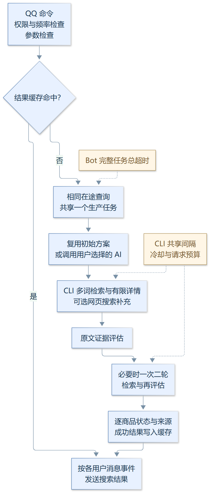

# vrc-booth-bot（VRC 对口）

基于 [NoneBot2](https://nonebot.dev/) + OneBot v11（NapCat）的 QQ bot，**专注 VRChat 素材圈**（VRC 对口）：接入 [booth-cli](https://github.com/wuhutakeoffyoo/booth-cli)，提供 Booth.pm 的 VRChat 商品搜索与以图搜图。关键词搜索自动附加 `--tag VRChat`（`VRC_TAG` 可关），结果收窄到 VRChat 商品圈。**CLI 只留钩子（`booth bot` JSON 信封），bot 侧负责实现**——本项目即实现侧。

## 亮点

- **三链路搜索，统一收敛 VRChat 圈**：日文关键词直搜 / 中文需求 LLM 转译 /
  以图搜图（识图模型读图生成关键词），三条链路全部收窄到 `VRChat` 商品圈。
- **小语种翻译不裸翻**：LLM 直译日语不可靠——借鉴 E 站（E-Hentai）AI 翻译本子类
  开源实践，以术语约束与写法规范驾驭模型：单词级关键词（Booth 多词 AND 匹配脆弱）、
  专有名词片假名完整转写、部位/用途行业词、假名读音与连写变体。
- **按商品说明提供适配证据**：「适用于XX素体的服装」类需求结合商品说明
  （対応素体/仕様 段落）排序，逐商品标注原文依据或未核实状态，实际适配仍以商品说明为准。
- **历史盲测记录**：每条链路盲抽 100 个 VRC 对口样本，目标准确率 ≥90%，
  跑测→改策略→复测。图文链路一测约 50% 撞上「艺术字干扰视觉 OCR」的瓶颈，
  接入 Exa 网络搜索与 LLM 自有知识库（知名模型/热门素材回忆）后二测突破到
  **93%**（JP 95% / ZH 100%）。这些历史结果未在当前版本复测；本轮验证见下文。
- **每一层都有退路**：通用主 API → 可选备用 API，文字失败时原词检索；
  网络检索兜底（DDG/Exa）、双层缓存与双层限速，所有降级如实告知用户。

## 0.3.1 更新

需要 booth-cli 1.5.0+，当前配套 CLI 1.5.1。默认通用 API，只填 `AI_API_KEY + AI_BASE_URL` 可自动发现模型；无模型列表时补填 `AI_MODEL`。支持 OpenAI 兼容、Anthropic 与 Gemini 原生协议，旧 VISION_* 兼容，新连接不继承旧模型名。网页搜索独立用 `SEARCH_API_KEY + SEARCH_BASE_URL`，支持通用 JSON、Exa、Tavily、Brave、SearXNG 与自定义适配器，不绑定 OpenCode/GLM 或 Exa。

启动及首次图片查询先检测多模态能力；未配置、不支持或检测暂不可用时，提示限制并关闭所有图片搜索入口，仅保留文字搜索。接入通过检测的多模态 API 后才允许识图和图片反查。配置、实现原理与能力流程图见 [AI_SETUP.md](AI_SETUP.md)。

## 0.2.0 更新

需要 booth-cli 1.4.0+。CLI 在同机跨进程共享请求间隔、429/503 冷却和单次查询出站预算。文本查询默认总时限 180 秒，首轮最多补 6 件完整详情；二轮最多 3 个新词、3 件新详情，展示复用已取得资料。

评估输入包含完整标题、品类、标签、说明摘录和商品 ID；引用必须属于对应来源。结果逐商品显示相关候选、未核实或不满足要求，并附原文；来源证据不保证兼容性。原有行业词顺序和保守重试保留。

翻页复用方案缓存，相同在途查询共享任务；取消一个等待者不影响其他人。缓存随固定代码/提示词与 CLI 源码指纹失效，计划/结果各自保存过期时间。部署后必须重启进程。

## 创新点与实现原理

本项目把面向 QQ 的异步查询与母项目的 CLI 检索能力组合起来：Bot 管理任务、用户通知和缓存，CLI 管理 BOOTH 出站请求；商品判断通过原文引用连接两层。以下均为已经实现的设计。



[放大查看 SVG](docs/images/search-flow.svg)

### 1. 相同查询共享计算，各用户保留自己的通知

缓存未命中时，`SingleFlight` 按查询 key 创建一个生产任务，后续相同查询加入等待；文本结果 key 包含模式、页码、查询和配置语义，图片查询还包含图片 URL。只有生产任务占用全局并发名额，减少重复 AI 和 BOOTH 调用。

每个等待者通过 `asyncio.shield` 等待共享任务，取消其中一个不会取消其他人的计算；返回结果做深拷贝，避免一个用户的处理修改另一个人的结果。进度通知各自绑定 bot 与消息事件，共享计算的同时保留各自的发送目标；生产任务有总超时，完成或失败会清理在途记录。

实现：[execution.py](src/plugins/booth_search/execution.py) 的 `SingleFlight`，接入 [__init__.py](src/plugins/booth_search/__init__.py) 的 `_do_search`、`_do_r18`。这是同一 Bot 进程内的任务合并，不提供跨实例任务共享。

### 2. 将“如何搜”和“这一页的结果”分别缓存

初始方案 key 不含页码，默认缓存 1800 秒，同一需求翻页可复用规划；结果 key 保留页码和成人模式，避免混用不同页面或筛选。带失败反馈的二轮重新规划不使用初始方案缓存。方案和结果各自保存 expires，写入短时方案不会按其 TTL 清理仍有效的长时结果。

缓存语义包含非敏感配置摘要、固定业务源码与提示词的 SHA-256 指纹，以及母项目 CLI 的语义指纹。缓存版本现为 11，包含 AI 与搜索适配模块、搜索端点、协议与 DDG 开关；凭据值与 .env 不进入摘要，后端 key 是否可用只记录布尔值。源码指纹在进程内缓存，代码更新后必须重启 Bot；文档修改不触发业务缓存失效。

实现：[qcache.py](src/plugins/booth_search/qcache.py) 的 `semantic_fingerprint`、`configuration_key`、`get / put`，以及 [__init__.py](src/plugins/booth_search/__init__.py) 的 `_cached_plan`。

### 3. 一次用户查询贯穿规划、CLI 和第二轮

`ContextVar` 保存 query_scope，CLI 包装器把 request_id、预算和 deadline 随每次 JSON 请求传给母项目。各 CLI 子进程的 BOOTH 请求使用同一个 SQLite 预算库，默认首轮 12 次、二轮总上限 18 次，计入重试、重定向和详情，扩展上限不重置计数或截止时间。CLI 出站许可不包含 AI 请求，也不提供 AI 账号配额管理。

Bot 用 `asyncio.wait_for` 约束完整文本任务，默认总时限 180 秒；不同阶段记录耗时，子进程信封的累计计数汇入 `metrics.wire_requests`。数据库不可用、服务冷却或预算耗尽会明确返回；子进程被强制终止而没有返回信封时，指标可能不完整。

实现：[execution.py](src/plugins/booth_search/execution.py) 的 `query_scope / stage / observe_wire`、[booth_client.py](src/plugins/booth_search/booth_client.py) 的 `call_booth`；共享出站控制由 [booth-cli/request_budget.py](https://github.com/wuhutakeoffyoo/booth-cli/blob/main/request_budget.py) 实现。

### 4. 有限获取详情，让商品判断附带可核验依据

每个检索词保留同一页已有候选，默认最多 60 件；合并去重后首轮最多补六件完整详情，二轮最多补三件新商品，展示复用已取得的资料。评估看到完整标题、品类、标签、商品 ID、来源摘要及最多 900 字符的说明摘录，标题不含检索词也可保留为候选。

模型必须返回属于对应商品字段的连续原文引用；带说明核实词的需求要求有可用 description 依据。明确否定阻止支持判断，缺少引用或详情时标为 unknown；不足三条有有效来源的命中不能维持整轮 ok。结果逐商品显示相关候选、未核实或评估提示不满足要求，并附原文。引用来源可验证，语义判断和实际兼容性仍需核查。

实现：[search_evidence.py](src/plugins/booth_search/search_evidence.py)、[__init__.py](src/plugins/booth_search/__init__.py) 的 `_handle_text / _enrich_entries`，文本及合并转发展示分别位于 [format.py](src/plugins/booth_search/format.py) 和 [forward.py](src/plugins/booth_search/forward.py)。

### 5. 让检索词、AI 输出和回退保持一致

AI 规划后，用固定行业词表识别复合需求中的正向术语，再补读音变体；二轮复用相同归一过程，去掉已搜索的词，最多使用三个新词。已知 GLM 文本模型设置结构化 JSON 及相应推理参数，减少推理占满输出而没有评估 JSON 的失败；其他模型保持原有参数。AI 不可用时用原词检索，评估不可用时明确标注候选未核实。

实现：[vision.py](src/plugins/booth_search/vision.py) 的 `plan_search / evaluate_results / apply_industry_synonyms`、[search_evidence.py](src/plugins/booth_search/search_evidence.py) 的 `structured_options`，以及 [__init__.py](src/plugins/booth_search/__init__.py) 的 AI 回退入口。母项目与 Bot 各自携带证据辅助模块，并通过契约测试检查一致性。

### 验证记录与适用范围

2026-10-02 的 0.3.1 / CLI 1.5.1 本地验证：Bot 169 项、CLI 149 项、母项目契约 6 项，共 324 项通过。覆盖全部图片入口关闭、真实图片拒绝后撤销能力、三类 AI 协议、搜索协议与自定义适配器、配置迁移、旧 key 隔离和搜索缓存失效；key 通过子进程环境传递，不进入参数。能力检测不代表搜品准确率复测。

2026-10-01 的 0.2.0 / CLI 1.4.0 配套验收：Bot 单元测试 113 项、CLI 单元测试 103 项、母项目契约测试 4 项，共 220 项通过；两仓库 Python 3.10 / 3.12 CI 通过。任务合并、取消和流程测试见 [test_execution.py](tests/test_execution.py)，缓存迁移及独立到期时间见 [test_qcache.py](tests/test_qcache.py)，真实 CLI 子进程契约见 [parent_contract.py](integration/parent_contract.py)。

线上内部“铃铛”查询单次耗时 19.9 秒，使用 12 个 BOOTH 请求，展示六件商品，其中三件有有效来源引用、三件未核实；服务启动与 OneBot 重连通过。没有人工测试 QQ 实际消息发送及客户端渲染。本地三条查询抽查含已有 HTTP 缓存，不能据此承诺冷启动耗时或整体准确率，历史 93% 记录未在这一版本重新证明。

`RUN_PROFILE=benchmark` 默认禁止 AI，评测需显式允许并准备独立账号/配额；同账号更换 key 不视为配额隔离。新的检索策略或第二评审模型应先经固定样本独立评测，再决定是否默认启用。

## 功能

- `/vrc search <关键词>` → 调 booth-cli 关键词搜索（自动收窄 VRChat 圈），返回 Top 结果（名称/价格/链接/店铺/R-18 标记）；末尾数字为页码（如 `/vrc search 猫娘女仆装 2`）
- `/vrc search` + 图片（或回复一张图片）→ 识图 AI 提取关键词 + booth-cli 反向图搜，
  多模态能力检测通过后才启用，双路合并返回候选
- 「适用于XX素体的服装」类需求：AI 同时产出标题关键词与说明文核实词，
  按商品说明（対応素体/仕様 段落）匹配后置顶，结果注明核实情况
- 部位/用途类需求（尾巴/耳朵/ギミック 等）由 AI 转成日本圈行业词多路检索
- R-18 过滤策略可配（`R18_MODE=include/exclude/only`）， adult 结果带标记展示

## 架构


[放大查看 SVG](docs/images/system-architecture.svg)

系统设计详解（运作原理、三链路设计、分层兜底思路、参考的开源项目、盲测方法论）
见 [ARCHITECTURE.md](ARCHITECTURE.md)。

部署与代理方案（云端 NapCat + 新加坡 booth 出口）见 [PROXY_DEPLOYMENT.md](PROXY_DEPLOYMENT.md)。

## 本地运行

```bash
pip install -e .          # 或 pip install "nonebot2[fastapi]" "nonebot-adapter-onebot" httpx
cp .env.example .env      # 填入 ONEBOT_ACCESS_TOKEN、AI_API_KEY、AI_BASE_URL 等
python bot.py             # 默认 0.0.0.0:8080，等 NapCat 反向 WS 接入
```

## 配置（.env / 环境变量）

| 变量 | 默认 | 说明 |
|---|---|---|
| `ONEBOT_ACCESS_TOKEN` | 空 | NapCat 反向 WS 的 access_token，两侧必须一致 |
| `BOOTH_CLI_PATH` | PATH 中找 `booth` | 也可指向 booth.py 绝对路径 |
| `AI_MODE` | api | 默认通用 API；cli 为显式旧文字模式 |
| `AI_API_KEY` | 空 | 通用 AI key；旧 VISION_API_KEY 兼容 |
| `AI_BASE_URL` | 空 | HTTPS 根端点或完整调用端点；旧 VISION_BASE_URL 兼容 |
| `AI_MODEL` | 空 | 自动发现模型；无模型列表时填写，旧 VISION_MODEL 兼容 |
| `AI_FALLBACK_API_KEY / AI_FALLBACK_BASE_URL / AI_FALLBACK_MODEL` | 空 | 可选备用 API，模型同样可自动发现 |
| `SEARCH_API_KEY / SEARCH_BASE_URL` | 空 | 用户选择的搜索服务，独立于 AI 配置 |
| `SEARCH_PROVIDER` | auto | json/exa/tavily/brave/searxng 或注册的适配器 |
| `SEARCH_DDG_ENABLED` | true | 是否保留免 key 的 DDG 补充 |
| `EXA_API_KEY / EXA_BASE_URL` | 空 / 原 Exa 端点 | 仅兼容旧配置；新搜索 URL 优先 |
| `VISION_TIMEOUT` | 60 | 识图请求超时（秒） |
| `BOOTH_LIMIT` | 6 | 返回候选上限 |
| `BOOTH_SORT` | `popularity` | 关键词搜索排序 |
| `R18_MODE` | `include` | include 联合搜索 / exclude / only |
| `IMGSEARCH_HEADLESS` | `true` | CLI 浏览器备援是否无头（服务器务必 true） |
| `IMGSEARCH_TIMEOUT` | 240 | 图搜超时（秒） |
| `SEARCH_TIMEOUT` | 60 | 搜索超时（秒） |
| `QUERY_TIMEOUT` | 180 | 文本查询总时限，30–600 秒 |
| `REQUEST_BUDGET` | 12 | 首轮 CLI 出站许可总数，含重试、重定向和详情 |
| `RETRY_REQUEST_BUDGET` | 18 | 二轮扩展后的总上限，不重置已消耗计数 |
| `SEARCH_CANDIDATE_LIMIT` | 60 | 同页候选上限，不自动抓更多页 |
| `PLAN_CACHE_TTL` | 1800 | 首轮方案缓存秒数，0 关闭；页码不入键 |
| `RUN_PROFILE` | production | benchmark 使用独立缓存语义且默认禁止 AI |
| `BENCHMARK_ALLOW_AI` | false | benchmark 显式允许 AI；先确认独立账号/配额 |
| `USER_COOLDOWN` | 10 | 同一用户两次搜索最小间隔（秒） |
| `USER_RATE_LIMIT` | 5 | 同一用户每分钟搜索次数上限 |
| `GLOBAL_CONCURRENCY` | 2 | 全局并发上限：同时处理的查询数（跨用户共享，防多用户并发打爆 booth.pm/AI 配额，满员告知稍后再试） |

**图片限制**：不能凭服务商或模型名字猜测视觉能力。只上传随机合成测试图验证；未通过时提示模型限制，关闭 QQ 图片、回复图片、内部字节及 CLI 图片入口，不下载或反查用户图片。文字 AI、站内文字检索和 Exa 继续可用。更换模型/端点/key 或重启后重新检测，详见 [AI_SETUP.md](AI_SETUP.md)。

凭据只从环境变量/.env 读取，本仓库不存任何 key。

不要用生产配额运行大规模盲测；同账号更换 key 不视为配额隔离。新检索策略或第二模型需固定样本独立评测后决定是否启用。本轮工程修复没有重新证明历史命中率。

## NapCat 侧（云端）

NapCat 的 OneBot 配置里添加反向 WS：

```json
{
  "enable": true,
  "urls": ["ws://<SG服务器公网IP>:8080/onebot/v11/ws"],
  "messagePostFormat": "array",
  "token": "<与 ONEBOT_ACCESS_TOKEN 相同>"
}
```

SG 安全组放行 8080（或自定端口）；建议 NapCat 与 bot 两侧都配 token，
公网裸奔 ws 会被扫。

## 测试

```bash
python -m unittest discover -s tests   # 纯逻辑单测（CLI 信封封装/格式化/识图 payload），不联网
```

端到端需要 NapCat + QQ 环境，服务器部署步骤见 PROXY_DEPLOYMENT.md。

## 开源说明

- 许可证：MIT（见 [LICENSE](LICENSE)）
- 本项目为个人工具，与 BOOTH/pixiv 官方无关联；使用时请遵守 Booth 利用条款（请求间隔 ≥1 秒，勿高并发）
- 无任何凭据入库：API key、QQ 账号等均通过 `.env` 本地配置
- 欢迎 Issue/PR；涉及部署（服务器/NapCat）的通用问题优先提 Issue
